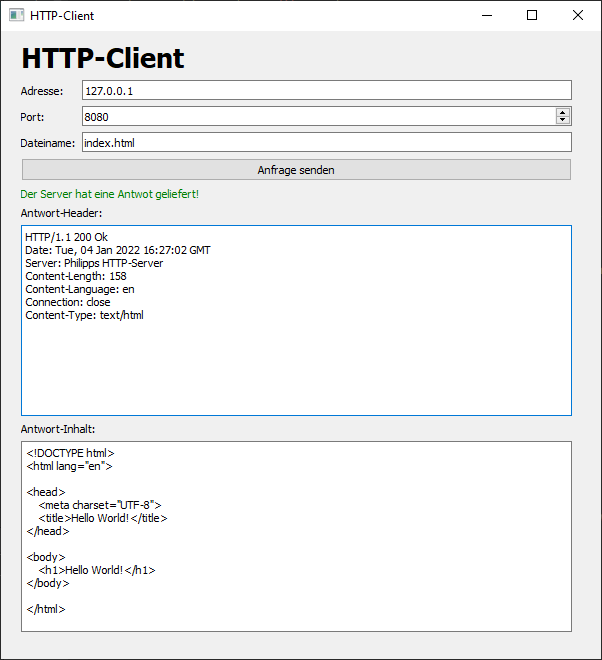

# HTTP-Server & HTTP-Client
 

Als Zusatzabgabe sollen wir im Fach PRIN einen HTTP-Server & HTTP-Client schreiben.

## Der HTTP-Server
Der HTTP-Server ist ein Konsolen-Programm geschrieben. Er läuft standardmäßig auf dem Port 8080. Er akzeptiert nur GET-Anfragen.
Alle Dateien, die ein Client sich von dem Server holen kann, liegen in dem Ordner "http_server/files/."

## Der HTTP-Client
Der HTTP-Client verfügt über eine grafische Oberfläche. Dort kann der Benutzer die Adresse und den Port des Servers auswählen. Dann gibt er die Datei an, die er anfordern möchte. Er schickt dann eine GET-Anfrage an den Server. Die Antwort wird danach dem Benutzer gezeigt. Bekommt der Client nach 5 Sekunden keine Antwort, gibt es einen Timeout-Fehler.

